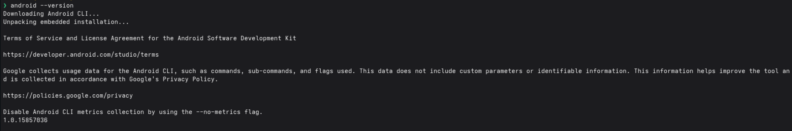
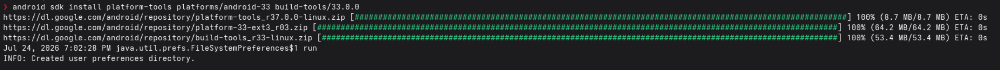
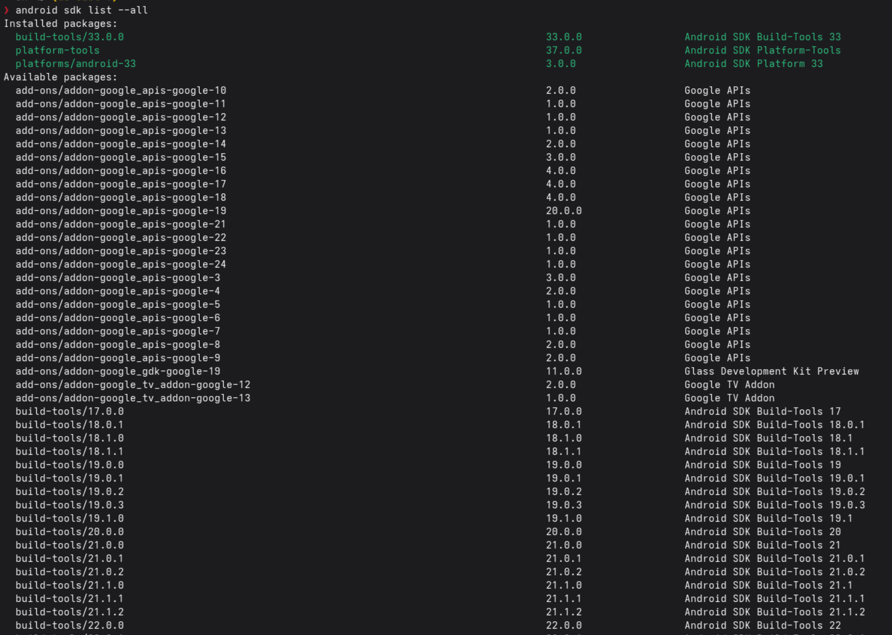
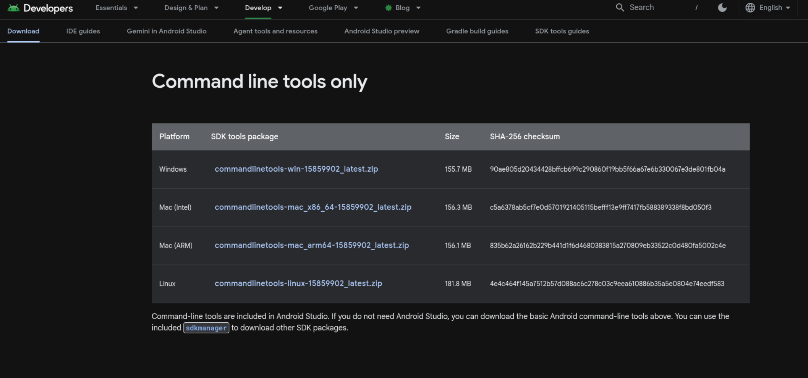

# android-sdk-for-linux

- The **Command Line Tools (`android-sdk`)** are minimal set of tools for developing `Android without an IDE`.
- current version 15859902, please always check the version, many of the commands or settings may change in the future. 

## install

- create folder android-sdk

```sh
unzip /home/user/Download/commandlinetools-linux-15859902_latest.zip -d /home/user/android-sdk/
```

- add the environment variables to your bashrc file

```sh
export ANDROID_SDK_ROOT=~/android-sdk
export PATH=$PATH:$ANDROID_SDK_ROOT/cmdline-tools/latest/bin
```

```sh
source ~/.bashrc
```

- create androidrc

```sh
echo "--sdk=/home/user/android-sdk" > ~/.androidrc
```

```sh
 android info
sdk: /home/user/android-sdk
version: 1.0.15857036
launcher_version: 1.0.15498356
```

- check version

```sh
android --version
```



- Google collects usage data for the Android CLI, such as commands, sub-commands, and flags used. 
This data does not include custom parameters or identifiable information. 
[This information helps improve the tool and is collected in accordance with Google's Privacy Policy.](https://policies.google.com/privacy)
- Disable Android CLI metrics collection by using the --no-metrics flag.

- example install packages

```sh
android sdk install platform-tools platforms/android-33 build-tools/33.0.0
```



- sdk list all

```sh
android sdk list --all
```



## uninstall

- remove environment variables

```sh
nano ~/.bashrc
```

```sh
export ANDROID_SDK_ROOT=~/android-sdk
export PATH=$PATH:$ANDROID_SDK_ROOT/cmdline-tools/latest/bin
```

```sh
source ~/.bashrc
```

- remove folder android-sdk

```sh
rm -rf /home/user/android-sdk
```

## run adv android

- example download system image

```sh
android sdk install "system-images;android-35;google_apis;x86_64"
```

## references

- please check out [developer android studio](https://developer.android.com/studio)
- please check out [android cli](https://developer.android.com/tools/agents/android-cli?hl=es-419)
- please check out [android sdk guide](https://github.com/mesaquen/android-cmdline-tools-guide/blob/main/guides/android_sdk_install_guide.md)
- download [SDK tools guides - command-line-tools-ony](https://developer.android.com/studio#command-line-tools-only)

